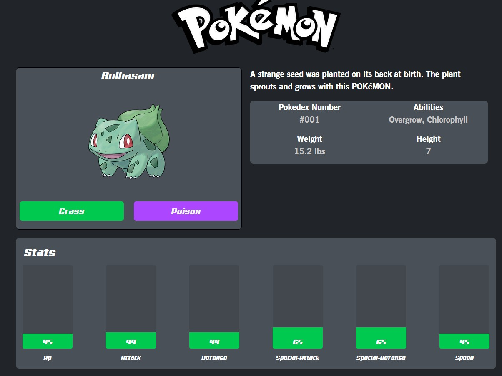

## Pokedex

A side project I made, which is a website that utilizes the PokeAPI. It contains all Pokemon data. Right now it's still work in progress as 
I plan to add features to improve UX. Currently there are missing features such as a search funciton, hover effects, transitions, etc.

### Technologies
- `React`
- `TypesScript`
- `HTML`
- `Tailwind CSS`
- `Vite`
- `PokeAPI`

### What I learned

### Nested API Calls

Working with the PokéAPI exposed me to deeply nested API responses and strengthened my ability to navigate and extract data efficiently to improve performance. For example,
instead of requesting a entire call all at once, we can request data only for what the user is viewing which improves loading times and responsiveness.

### Future Improvements

I plan to add transitions and visual effects to make animations smoother and interactions feel more responsive. Right now there are no transitions and visual effects.

There is no search function as of right now. I am unsure of how to implement it right now.

I could also find a way to cache API responses to avoid repeated API calls

## Running the Pokedex

1. Clone the repository to your local machine.
2. Install Vite by running: `npm install vite@latest`
3. Install React Router with: `npm install react-router-dom`
4. Start the development server using: `npm run dev`
5. Open your browser and navigate to `http://localhost:5173`

 

